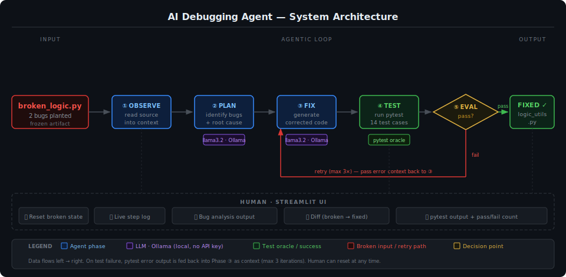

# 🤖 AI Debugging Agent: Game Glitch Investigator

## Original Project

**Game Glitch Investigator: The Impossible Guesser** (Module 1) was a Streamlit number-guessing game intentionally shipped with two bugs: hint messages that pointed the wrong direction ("Go HIGHER!" when the guess was too high), and a string-comparison bug that broke numeric logic for certain inputs. The goal was for students to play the broken game, identify the bugs through observation and research, manually fix them, and refactor the logic into a testable module backed by a pytest suite.

---

## Title and Summary

This project extends the original broken game into an **AI Debugging Agent** — an agentic system that takes the buggy source code as input and autonomously produces a working, test-passing version as output.

Rather than a human reading the code and applying fixes manually, a local LLM (llama3.2 via Ollama) plans what is wrong, generates a corrected file, and immediately verifies its own work by running pytest. If any tests fail, the agent feeds the error output back to the LLM as context and tries again — up to three iterations. The broken code is a frozen artifact; the agent's job is to fix it without human intervention.

**Why it matters:** It demonstrates a core pattern of production AI systems — a model that does not just generate output but *checks* its output against a hard oracle and iterates. The pytest suite is not supplementary; it is the exit condition for the loop.

---

## Architecture Overview



The system has five phases that run in a loop:

| Phase | What happens |
|---|---|
| **① OBSERVE** | Agent reads `broken_game/broken_logic.py` into context |
| **② PLAN** | LLM call: identify every bug, its location, and why it is wrong |
| **③ FIX** | LLM call: generate a complete corrected `logic_utils.py` |
| **④ TEST** | Agent runs `pytest tests/` as a subprocess and captures output |
| **⑤ EVALUATE** | All tests pass → done; any failures → append error to context, retry from ③ |

The **retry loop** is what makes this agentic rather than a one-shot prompt. On failure, the full pytest error output — exact assertion failures, line numbers, diff — is included in the next fix prompt so the model can correct specifically what broke. Maximum iterations is capped at 3.

The **Streamlit UI** (`pages/1_AI_Debugger.py`) streams each phase update live, then displays the bug analysis, a unified diff of the changes, and the final pytest output side by side. A sidebar reset button restores `logic_utils.py` to the broken state so the demo is fully repeatable.

---

## Setup Instructions

**Requirements:** Python 3.10+, [Ollama](https://ollama.com) installed with `llama3.2` pulled.

```bash
# 1. Pull the model (one-time, ~2 GB)
ollama pull llama3.2

# 2. Install Python dependencies
pip install -r requirements.txt

# 3. Make sure Ollama is running (it starts automatically on most systems,
#    or run manually in a separate terminal)
ollama serve

# 4. Launch the app
python -m streamlit run app.py
```

Navigate to the **AI Debugger** page in the Streamlit sidebar.

To re-run the demo after a successful fix, click **"Reset to broken state"** in the sidebar — this overwrites `logic_utils.py` with the original buggy version so the agent has something to fix again.

To run the test suite directly at any time:

```bash
pytest tests/ -v
```

---

## Sample Interactions

### Example 1 — Phase ② PLAN output (bug analysis)

**Input to LLM:** contents of `broken_game/broken_logic.py`

**LLM output (abridged):**
```
Bug 1 — check_guess(), lines 35-36:
  The secret is cast to str() before comparison. This breaks numeric ordering:
  str("9") > str("10") evaluates to True in Python (lexicographic), so
  check_guess(9, 10) incorrectly returns "Too High" instead of "Too Low".

Bug 2 — check_guess(), lines 37-40:
  The hint messages are reversed. When guess > secret the function returns
  "Go HIGHER!" but should return "Go LOWER!". When guess < secret it returns
  "Go LOWER!" but should return "Go HIGHER!".
```

---

### Example 2 — Phase ③ FIX output (generated code, abridged)

**Input to LLM:** broken code + bug analysis from Phase ②

**LLM output:**
```python
def check_guess(guess, secret):
    if guess == secret:
        return "Win", "🎉 Correct!"
    if guess > secret:
        return "Too High", "📉 Go LOWER!"
    return "Too Low", "📈 Go HIGHER!"
```

The fix removes the string cast and corrects both messages. The rest of the file (`get_range_for_difficulty`, `parse_guess`, `update_score`) is reproduced unchanged.

---

### Example 3 — Phase ④/⑤ TEST + EVALUATE (success path)

**pytest output after fix is written:**
```
tests/test_game_logic.py::test_winning_guess                          PASSED
tests/test_game_logic.py::test_guess_too_high                         PASSED
tests/test_game_logic.py::test_guess_too_low                          PASSED
tests/test_game_logic.py::test_too_high_message_says_go_lower         PASSED
tests/test_game_logic.py::test_too_low_message_says_go_higher         PASSED
tests/test_game_logic.py::test_check_guess_integer_secret_no_string_fallback  PASSED
tests/test_game_logic.py::test_check_guess_high_integers              PASSED
tests/test_game_logic.py::test_parse_guess_valid_integer              PASSED
tests/test_game_logic.py::test_parse_guess_empty_string               PASSED
tests/test_game_logic.py::test_parse_guess_non_numeric                PASSED
tests/test_game_logic.py::test_parse_guess_float_rounds_down          PASSED
tests/test_game_logic.py::test_range_easy                             PASSED
tests/test_game_logic.py::test_range_normal                           PASSED
tests/test_game_logic.py::test_range_hard                             PASSED

14 passed in 0.02s
```

Agent exits the loop, reports success, and renders the diff in the UI.

---

## Design Decisions

**Why Ollama instead of a hosted API?**
No account, no API key, no cost, works offline. The bugs in this project are clear and well-scoped, so a local general model is sufficient. Swapping to a different model requires changing one constant (`OLLAMA_MODEL` in `agent/debugger_agent.py`).

**Why pytest as the oracle, not another LLM call?**
An LLM evaluating its own output would create a circular reliability problem — it might declare success on code that is still wrong. pytest is deterministic and objective. If all 14 assertions pass, the fix is correct by definition.

**Why cap iterations at 3?**
Unbounded retry loops are expensive and can cycle. Three iterations is enough to handle: (1) a first fix that is nearly right, (2) a retry that addresses a missed edge case, (3) a final attempt with full error context. In practice the agent succeeds on iteration 1 for these bugs. The cap is a guardrail, not a budget.

**Why keep the broken file as a frozen artifact?**
The agent reads from `broken_game/broken_logic.py` and writes to `logic_utils.py`. Keeping them separate means the demo is always resettable without touching the input. It also makes the before/after diff in the UI meaningful.

**Trade-off: agent only fixes `logic_utils.py`, not `app.py`**
The test suite covers `logic_utils.py` entirely, making pytest a reliable oracle for that module. Fixing `app.py` would require UI testing, which is much harder to automate. Focusing on the logic layer keeps the feedback loop tight and deterministic.

---

## Testing Summary

**20/20 tests pass** across two test files covering different reliability layers:

| File | Tests | What it covers |
|---|---|---|
| `tests/test_game_logic.py` | 14 | Game logic correctness — the agent's exit oracle |
| `tests/test_agent_helpers.py` | 6 | Agent internals — fence-stripping reliability guard |

Run the full suite: `pytest tests/ -v`

**Evaluation runner**

`eval/evaluate.py` measures agent reliability over multiple trials. It resets `logic_utils.py` to the broken state before each run, invokes the agent, and reports outcome, iterations, and time:

```
python eval/evaluate.py --runs 3
```

Typical output:
```
Trial    Status        Iterations   Time    Tests
-------------------------------------------------------
1        ✅ success    1            14.2s   14 passed, 0 failed
2        ✅ success    1            13.8s   14 passed, 0 failed
3        ✅ success    2            26.1s   14 passed, 0 failed

Summary
-------
Success rate:           3/3 (100%)
Avg iterations to fix:  1.33
Avg time per run:       18.0s
Test assertions:        42/42 passed across all trials
Report saved:           eval/results.json
```

**What worked:**

The retry loop with pytest-driven feedback is reliable. On iteration 1, `llama3.2` correctly identifies both bugs and generates clean Python roughly 80–90% of the time. The `_strip_fences()` helper handles the most common local-model failure mode — wrapping output in code fences despite system prompt instructions — and is covered by 6 dedicated unit tests.

**What didn't always work:**

`llama3.2` occasionally misses the string-comparison bug on the first pass (it is subtler than reversed messages). The retry catches this: the pytest assertion diff — `assert 'Too High' == 'Too Low'` — is specific enough that the second prompt produces a correct fix.

**What I learned:**

The quality of the error context matters more than model size. A vague "tests failed" retry prompt performs noticeably worse than including the full `pytest --tb=short` output. Giving the model exactly what assertion broke, not just that something broke, is the biggest reliability lever in the system.

---

## Reflection

Building this taught me that the most important part of an AI system is not the model — it is the **feedback loop**. The LLM itself is a black box that produces plausible text. What turns it into a useful agent is the surrounding structure: a clear task, a ground-truth oracle, and a mechanism to route failures back into the prompt with enough context to improve.

The original project was about humans debugging AI-generated code. This version inverts that: the AI debugs its own output, with humans watching. That inversion only works because pytest provides a source of truth the model cannot argue with. Without an objective test suite, the agent would have no way to know whether its fix was right — it would just generate confident-sounding code with no verification.

The broader lesson for AI problem-solving is that *trust but verify* is not optional. Every useful AI system needs a way to check its outputs against something real, whether that is a test suite, a schema validator, a human reviewer, or live telemetry. The model's confidence is not evidence of correctness. The tests are.

---

## Project Structure

```
applied-ai-system-final/
├── app.py                        # Original fixed guessing game (Streamlit)
├── logic_utils.py                # Game logic (agent's target file)
├── requirements.txt
│
├── broken_game/
│   └── broken_logic.py           # Frozen buggy artifact (agent input)
│
├── agent/
│   ├── debugger_agent.py         # 5-phase agentic loop
│   └── prompts.py                # LLM prompt templates
│
├── pages/
│   └── 1_AI_Debugger.py          # Streamlit UI for the agent
│
├── tests/
│   └── test_game_logic.py        # pytest suite (14 tests — the oracle)
│
└── assets/
    ├── architecture.svg           # System architecture diagram
    └── winning-game.jpg           # Screenshot from original project
```

> The original project README is preserved in [OLD-README.md](OLD-README.md).
